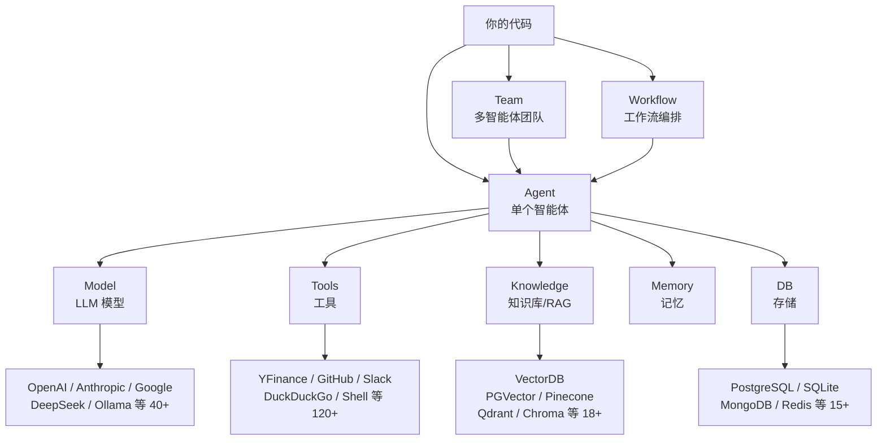

# Agno 框架项目全面梳理

> Agno 是一个构建、运行和管理 **AI Agent（智能体）** 的全栈框架。它让你用 Python 快速组装出能调用工具、记忆对话、协同工作的 AI 应用，并直接部署为生产级 API。

---

## 1. 项目总体架构



Agno 分为 **三层**：

| 层级 | 作用 | 对应代码 |
|------|------|---------|
| **Framework** | 构建 Agent、Team、Workflow | `libs/agno/agno/` |
| **Runtime** | 部署为 FastAPI 生产 API | `agno.os.AgentOS` |
| **Control Plane** | Web UI 监控管理 | [os.agno.com](https://os.agno.com) |

---

## 2. 目录结构速查

```
agno/
├── libs/agno/agno/          # 核心框架源码 ⭐
│   ├── agent/               # Agent 智能体（核心入口）
│   ├── team/                # Team 多智能体协作
│   ├── workflow/            # Workflow 工作流编排
│   ├── models/              # LLM 模型适配层（40+ 提供商）
│   ├── tools/               # 工具集（120+ 集成）
│   ├── knowledge/           # 知识库 & RAG
│   ├── memory/              # 记忆管理
│   ├── db/                  # 数据库存储适配器
│   ├── vectordb/            # 向量数据库适配器
│   ├── guardrails/          # 安全护栏
│   ├── reasoning/           # 推理能力
│   ├── learn/               # 自学习
│   ├── os/                  # AgentOS 运行时
│   └── ...                  # eval, hooks, tracing 等
├── cookbook/                  # 示例 & 教程 ⭐
│   ├── 00_quickstart/       # 快速入门
│   ├── 02_agents/           # Agent 高级用法
│   ├── 03_teams/            # Team 示例
│   ├── 04_workflows/        # Workflow 示例
│   ├── 07_knowledge/        # 知识库/RAG
│   ├── 08_learning/         # 自学习（标杆示例）
│   ├── 90_models/           # 各模型提供商示例
│   ├── 91_tools/            # 各工具示例
│   └── ...
├── scripts/                  # 开发脚本（格式化、校验、部署）
├── AGENTS.md                 # AI Agent 开发规范
└── .cursorrules             # 编码约定
```

---

## 3. 核心概念详解

### 3.1 Agent — 智能体（最核心）

**Agent 是 Agno 的基石。** 一个 Agent = 一个 LLM 模型 + 工具 + 指令 + 可选的记忆/知识/存储。

**最简用法：**

```python
from agno.agent import Agent
from agno.models.google import Gemini

agent = Agent(
    name="My Agent",
    model=Gemini(id="gemini-3-flash-preview"),
    instructions="You are a helpful assistant.",
    markdown=True,
)

# 直接运行并打印
agent.print_response("Hello!", stream=True)
```

**带工具的 Agent：**

```python
from agno.agent import Agent
from agno.models.google import Gemini
from agno.tools.yfinance import YFinanceTools

agent = Agent(
    name="Finance Agent",
    model=Gemini(id="gemini-3-flash-preview"),
    tools=[YFinanceTools(all=True)],        # 赋予金融数据查询能力
    instructions="You are a financial analyst.",
    add_datetime_to_context=True,           # 让 Agent 知道当前时间
    markdown=True,
)
agent.print_response("What's NVDA's current price?", stream=True)
```

**Agent 关键参数一览：**

| 参数 | 作用 |
|------|------|
| `model` | 指定 LLM（必选） |
| `instructions` | 系统提示词/指令 |
| `tools` | 工具列表 |
| `knowledge` | 知识库（RAG） |
| `db` | 持久化存储 |
| `output_schema` | 结构化输出（Pydantic Model） |
| `add_history_to_context` | 将聊天历史加入上下文 |
| `reasoning` | 启用逐步推理 |
| `stream` | 流式输出 |
| `debug_mode` | 调试模式 |

> 完整参数列表见 [agent.py](file:///d:/programs/agno/libs/agno/agno/agent/agent.py)，共 **80+ 个可配置参数**。

---

### 3.2 Model — 模型适配层

Agno 统一封装了 **40+ LLM 提供商**，同一套代码轻松切换模型：

```python
from agno.models.openai import OpenAIChat
from agno.models.anthropic import Claude
from agno.models.google import Gemini
from agno.models.deepseek import DeepSeek
from agno.models.ollama import Ollama      # 本地模型

# 只需换 model= 参数即可
agent = Agent(model=OpenAIChat(id="gpt-4o"))
agent = Agent(model=Claude(id="claude-sonnet-4-6"))
agent = Agent(model=Ollama(id="llama3"))
```

**部分支持的模型提供商：**

| 提供商 | 模块 | 说明 |
|--------|------|------|
| OpenAI | `agno.models.openai` | GPT-4o, GPT-4 等 |
| Anthropic | `agno.models.anthropic` | Claude 系列 |
| Google | `agno.models.google` | Gemini 系列 |
| DeepSeek | `agno.models.deepseek` | DeepSeek 系列 |
| Ollama | `agno.models.ollama` | 本地部署 |
| AWS Bedrock | `agno.models.aws` | AWS 托管 |
| Azure | `agno.models.azure` | Azure OpenAI |
| Groq | `agno.models.groq` | 高速推理 |
| Mistral | `agno.models.mistral` | Mistral 系列 |

---

### 3.3 Tools — 工具（让 Agent 操作外部世界）

工具让 Agent 能**调用 API、读写文件、搜索网页**等。内置 **120+ 工具**，也可自定义。

```python
from agno.tools.duckduckgo import DuckDuckGoTools  # 网页搜索
from agno.tools.github import GithubTools           # GitHub 操作
from agno.tools.slack import SlackTools              # Slack 消息
from agno.tools.shell import ShellTools              # 执行命令
from agno.tools.python import PythonTools            # 执行 Python
from agno.tools.file import FileTools                # 文件操作
```

**自定义工具（用普通函数）：**

```python
def get_weather(city: str) -> str:
    """获取指定城市天气"""
    return f"{city}: 晴, 25°C"

agent = Agent(tools=[get_weather])  # 直接传入函数
```

---

### 3.4 Team — 多智能体团队

多个 Agent 协作完成复杂任务。团队有一个 **Leader** 负责协调和综合。

```python
from agno.team.team import Team

bull = Agent(name="Bull", role="看多分析师", ...)
bear = Agent(name="Bear", role="看空分析师", ...)

team = Team(
    name="Investment Team",
    model=Gemini(id="gemini-3-flash-preview"),
    members=[bull, bear],                  # 团队成员
    instructions="综合多空观点给出投资建议",
    markdown=True,
)
team.print_response("Should I invest in NVIDIA?", stream=True)
```

**Team vs Agent：**
- 单一任务 → 用 **Agent**
- 需要多视角/专业分工 → 用 **Team**

---

### 3.5 Workflow — 工作流编排

当你需要 **顺序执行、精确控制步骤** 时使用 Workflow，每个 Step 绑定一个 Agent：

```python
from agno.workflow import Step, Workflow

workflow = Workflow(
    name="Research Pipeline",
    steps=[
        Step(name="数据收集", agent=data_agent),
        Step(name="数据分析", agent=analyst_agent),
        Step(name="报告撰写", agent=writer_agent),
    ],
)
workflow.print_response("Analyze NVIDIA", stream=True)
```

**Workflow vs Team：**

| 特性 | Workflow | Team |
|------|----------|------|
| 执行顺序 | **确定的**，步骤按序执行 | **动态的**，Leader 决定 |
| 数据流 | Step N → Step N+1 | 成员间自由协作 |
| 适用场景 | 流水线、管道 | 讨论、辩论、协作 |

Workflow 还支持 **并行 (Parallel)、条件 (Condition)、循环 (Loop)、路由 (Router)** 等高级模式。

---

### 3.6 Knowledge — 知识库 & RAG

让 Agent 基于**你的私有数据**回答问题，支持 PDF、网页、数据库等多种数据源：

```python
from agno.knowledge.knowledge import Knowledge
from agno.vectordb.pgvector import PgVector

knowledge = Knowledge(
    vector_db=PgVector(table_name="docs", db_url="..."),
)
# 加载文档到知识库
knowledge.load(...)

agent = Agent(knowledge=knowledge, search_knowledge=True)
```

**支持的向量数据库：** PGVector、Pinecone、Qdrant、ChromaDB、Milvus、Weaviate、LanceDB、Redis 等 **18+**。

---

### 3.7 Memory — 记忆

让 Agent 记住用户偏好和历史信息：

```python
agent = Agent(
    db=SqliteDb(db_file="agent.db"),
    update_memory_on_run=True,         # 每次对话后更新记忆
    add_memories_to_context=True,      # 将记忆加入上下文
    add_history_to_context=True,       # 将聊天历史加入上下文
    num_history_runs=3,                # 保留最近 3 轮历史
)
```

---

### 3.8 DB — 存储

Agno 支持 **15+ 数据库** 来持久化会话、状态和记忆：

| 数据库 | 模块 | 用途 |
|--------|------|------|
| **PostgreSQL** | `agno.db.postgres` | 生产环境推荐 |
| **SQLite** | `agno.db.sqlite` | 开发/测试 |
| MongoDB | `agno.db.mongo` | 文档存储 |
| Redis | `agno.db.redis` | 缓存/快速存取 |
| DynamoDB | `agno.db.dynamo` | AWS 场景 |
| Firestore | `agno.db.firestore` | GCP 场景 |

---

## 4. 如何运行

### 环境准备

```bash
# 方式 1: 使用 cookbook 专用虚拟环境
./scripts/demo_setup.sh           # 安装所有 cookbook 依赖
.venvs/demo/bin/python cookbook/00_quickstart/agent_with_tools.py

# 方式 2: 开发环境
./scripts/dev_setup.sh            # 安装开发依赖
source .venv/bin/activate
```

### 运行 Cookbook 示例

```bash
# 运行单个示例
.venvs/demo/bin/python cookbook/00_quickstart/agent_with_tools.py

# 启动 AgentOS（Web UI 后端）
.venvs/demo/bin/python cookbook/00_quickstart/run.py
# 然后访问 https://os.agno.com 连接 localhost:7777
```

### API Key 配置

大多数模型需要 API Key，设置对应的环境变量：

```bash
export OPENAI_API_KEY="sk-..."
export ANTHROPIC_API_KEY="sk-..."
export GOOGLE_API_KEY="..."
```

---

## 5. Cookbook 目录导航

| 目录 | 主题 | 学习内容 |
|------|------|---------|
| `00_quickstart/` | **快速入门** ⭐ | Agent、Team、Workflow 的基础用法 |
| `01_demo/` | Demo 展示 | 完整演示应用 |
| `02_agents/` | Agent 深入 | 高级 Agent 配置与模式 |
| `03_teams/` | 多智能体团队 | 团队协作模式 |
| `04_workflows/` | 工作流 | 顺序/并行/条件/循环执行 |
| `06_storage/` | 存储 | 各数据库的使用方式 |
| `07_knowledge/` | 知识库/RAG | 文档加载、向量检索 |
| `08_learning/` | 自学习 | **标杆示例** — Agent 自我改进 |
| `10_reasoning/` | 推理 | 逐步推理能力 |
| `11_memory/` | 记忆 | 用户记忆管理 |
| `90_models/` | 模型 | 各 LLM 提供商的使用 |
| `91_tools/` | 工具 | 各工具的独立示例 |

> **推荐学习路径：** `00_quickstart/agent_with_tools.py` → `multi_agent_team.py` → `sequential_workflow.py` → 按需探索其他目录

---

## 6. 部署到生产（AgentOS）

AgentOS 将 Agent 封装为 **FastAPI 服务**：

```python
from agno.agent import Agent
from agno.os import AgentOS

agent = Agent(name="My Agent", model=..., tools=[...])
agent_os = AgentOS(agents=[agent], tracing=True)
app = agent_os.get_app()  # 返回 FastAPI app

# 启动: uvicorn run:app --port 8000
```

生产特性：
- 无状态、可水平扩展
- 按用户/会话隔离
- 内置 tracing 和审计日志
- 50+ API 端点

---

## 7. 关键设计原则

根据 [.cursorrules](file:///d:/programs/agno/.cursorrules) 和 [AGENTS.md](file:///d:/programs/agno/AGENTS.md)：

1. **不要在循环中创建 Agent** — 复用以提高性能
2. **用 `output_schema` 做结构化输出** — 获取类型安全的响应
3. **生产环境用 PostgreSQL**，开发用 SQLite
4. **从单个 Agent 开始**，有必要再扩展到 Team/Workflow
5. **所有公共方法都要有同步和异步版本**

---

## 8. 一句话总结

> **Agno = Agent(LLM + Tools + Knowledge + Memory) × Team/Workflow × AgentOS**
>
> 用 Python 构建智能体 → 组成团队或工作流 → 一键部署为生产 API。
